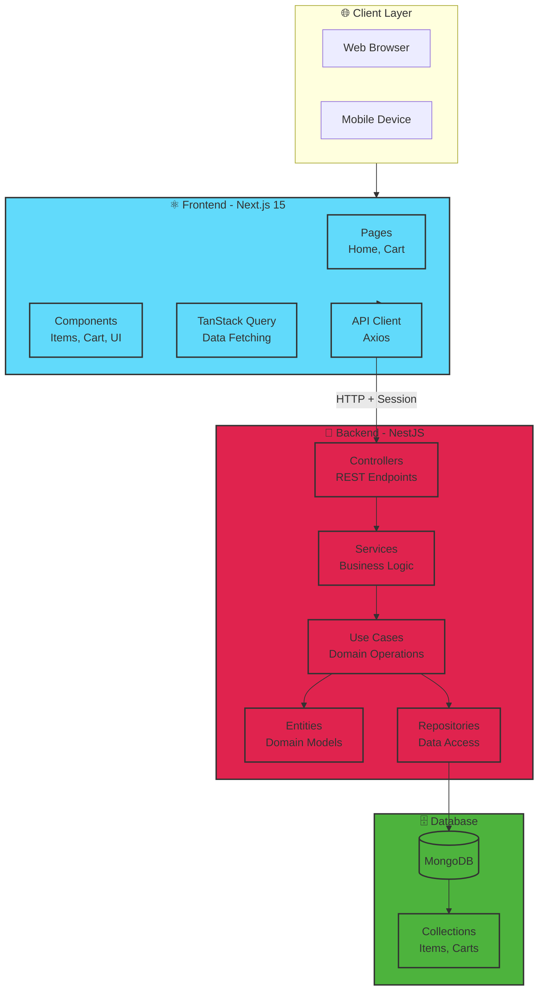

# 🛒 Shopping Cart Fullstack Application

A modern, production-ready shopping cart system built with **Next.js 15**, **NestJS**, and **MongoDB**. This monorepo demonstrates clean architecture, modern development practices, and seamless frontend-backend integration.

---

## 📑 Table of Contents

- [✨ Overview](#-overview)
- [🏗️ Architecture](#️-architecture)
- [🧰 Tech Stack](#-tech-stack)
- [⚙️ Prerequisites](#️-prerequisites)
- [🚀 Quick Start](#-quick-start)
  - [🐳 Docker (Recommended)](#-docker-recommended)
  - [💻 Local Development](#-local-development)
- [📁 Project Structure](#-project-structure)
- [🌐 API Endpoints](#-api-endpoints)
- [📱 Features](#-features)
- [🔧 Environment Variables](#-environment-variables)
- [🛠️ Technical Decisions](#️-technical-decisions)
- [📚 Documentation](#-documentation)
- [👨‍💻 Author](#-author)
- [📄 License](#-license)

---

## ✨ Overview

This project implements a complete e-commerce shopping cart system with the following capabilities:

**Frontend (Next.js 15):**
- Browse products and events
- Add items to cart with real-time stock validation
- Update quantities and manage cart items
- View cart summary with totals
- Responsive, Apple-inspired UI design

**Backend (NestJS):**
- RESTful API with Swagger documentation
- MongoDB integration with Mongoose ODM
- Session-based cart management
- Stock control and validation
- Layered architecture with Clean principles

**Key Features:**
- ✅ Session-based anonymous shopping
- ✅ Real-time stock validation
- ✅ Two item types: Products & Events
- ✅ Automatic quantity updates
- ✅ Cart persistence across sessions
- ✅ Modern, responsive UI
- ✅ Full TypeScript coverage
- ✅ Docker support

---

## 🏗️ Architecture



### Architectural Patterns

**Backend:**
- **Layered Architecture** with Clean Architecture principles
- **Domain-Driven Design** for business logic
- **Repository Pattern** for data access abstraction
- **Use Case Pattern** for single-responsibility operations

**Frontend:**
- **Component-Based Architecture** with React
- **Server Components** and Client Components (Next.js 15)
- **TanStack Query** for server state management
- **Atomic Design** principles for UI components

---

## 🧰 Tech Stack

### Frontend
| Category | Technology | Version |
|----------|------------|---------|
| Framework | Next.js | 15.x |
| Language | TypeScript | 5.x |
| UI Library | React | 19.x |
| Styling | Tailwind CSS | 4.x |
| Data Fetching | TanStack Query | 5.x |
| HTTP Client | Axios | 1.x |
| Icons | Lucide React | Latest |
| Notifications | React Hot Toast | Latest |

### Backend
| Category | Technology | Version |
|----------|------------|---------|
| Framework | NestJS | 10.x |
| Language | TypeScript | 5.x |
| Database | MongoDB | Latest |
| ODM | Mongoose | 8.x |
| Validation | class-validator | Latest |
| Documentation | Swagger/OpenAPI | Latest |
| Session | express-session | Latest |

### DevOps
| Category | Technology |
|----------|------------|
| Containerization | Docker & Docker Compose |
| Version Control | Git |
| Package Manager | npm |

---

## ⚙️ Prerequisites

- **Node.js** v20 or higher
- **npm** v10 or higher
- **MongoDB** (local or Atlas)
- **Docker & Docker Compose** (optional, for containerized deployment)
- **Git** for version control

---

## 🚀 Quick Start

### 🐳 Docker (Recommended)

The fastest way to run the entire stack:

```bash
# Clone the repository
git clone https://github.com/SebastianBC09/shopping-cart
cd shopping-cart-fullstack

# Start all services
docker-compose up --build

# Services will be available at:
# - Frontend: http://localhost:3000
# - Backend API: http://localhost:3001/api/v1
# - API Documentation: http://localhost:3001/api/docs
# - MongoDB: localhost:27017
```

That's it! The application is now running with:
- ✅ Frontend ready to use
- ✅ Backend API running
- ✅ MongoDB with seeded data
- ✅ All services connected

---

### 💻 Local Development

#### 1. Clone and Setup

```bash
# Clone the repository
git clone https://github.com/SebastianBC09/shopping-cart
cd shopping-cart-fullstack

# Install dependencies for both frontend and backend
npm run install:all
# Or manually:
cd backend && npm install
cd ../frontend && npm install
```

#### 2. Configure Environment Variables

**Backend** (`backend/.env`):
```bash
cd backend
cp .env.example .env
# Edit .env with your configuration
```

```env
NODE_ENV=development
PORT=3001
API_PREFIX=api/v1

MONGODB_URI=mongodb://localhost:27017/shopping_cart
CORS_ORIGIN=http://localhost:3000
SWAGGER_ENABLED=true
SESSION_SECRET=your-secret-key-change-in-production
```

**Frontend** (`frontend/.env.local`):
```bash
cd frontend
cp .env.local.example .env.local
# Edit .env.local with your configuration
```

```env
NEXT_PUBLIC_API_URL=http://localhost:3001/api/v1
```

#### 3. Start MongoDB

```bash
# Option 1: Using Docker
docker run -d -p 27017:27017 --name shopping-cart-mongo mongo:latest

# Option 2: Local MongoDB
# Make sure MongoDB is running on localhost:27017
```

#### 4. Seed the Database

```bash
cd backend
npm run seed
```

This will populate your database with:
- 2 sample products (Sunglasses, T-Shirt)
- 2 sample events (Concert, Festival)

#### 5. Start Development Servers

**Terminal 1 - Backend:**
```bash
cd backend
npm run start:dev
# Backend running on http://localhost:3001
```

**Terminal 2 - Frontend:**
```bash
cd frontend
npm run dev
# Frontend running on http://localhost:3000
```

#### 6. Access the Application

- **Frontend:** [http://localhost:3000](http://localhost:3000)
- **Backend API:** [http://localhost:3001/api/v1](http://localhost:3001/api/v1)
- **API Docs (Swagger):** [http://localhost:3001/api/docs](http://localhost:3001/api/docs)

---

## 📁 Project Structure

```
shopping-cart-fullstack/
│
├── backend/                      # NestJS Backend
│   ├── src/
│   │   ├── config/              # App configuration
│   │   ├── modules/
│   │   │   ├── items/           # Items module
│   │   │   │   ├── domain/      # Entities, enums
│   │   │   │   ├── application/ # DTOs, use cases
│   │   │   │   ├── infrastructure/ # Schemas, repos
│   │   │   │   ├── presentation/ # Controllers
│   │   │   │   ├── items.service.ts
│   │   │   │   └── items.module.ts
│   │   │   └── cart/            # Cart module
│   │   │       ├── domain/
│   │   │       ├── application/
│   │   │       ├── infrastructure/
│   │   │       ├── presentation/
│   │   │       ├── cart.service.ts
│   │   │       └── cart.module.ts
│   │   ├── database/
│   │   │   └── seeders/         # Database seeders
│   │   ├── app.module.ts
│   │   └── main.ts
│   ├── test/                    # Tests
│   ├── .env.example
│   ├── package.json
│   └── README.md
│
├── frontend/                     # Next.js Frontend
│   ├── src/
│   │   ├── app/                 # Next.js app directory
│   │   │   ├── layout.tsx
│   │   │   ├── page.tsx         # Home page
│   │   │   ├── cart/
│   │   │   │   └── page.tsx     # Cart page
│   │   │   └── globals.css
│   │   ├── components/
│   │   │   ├── layout/          # Header, Footer
│   │   │   ├── items/           # Item components
│   │   │   ├── cart/            # Cart components
│   │   │   └── ui/              # Base UI components
│   │   └── lib/
│   │       ├── api/             # API client
│   │       ├── hooks/           # Custom hooks
│   │       ├── providers/       # React providers
│   │       ├── types/           # TypeScript types
│   │       └── utils/           # Utilities
│   ├── public/
│   ├── .env.local.example
│   ├── package.json
│   └── README.md
│
├── docker-compose.yml            # Docker orchestration
├── .gitignore
├── package.json                  # Root scripts
└── README.md                     # This file
```

---

## 🌐 API Endpoints

### Items Endpoints

| Method | Endpoint | Description |
|--------|----------|-------------|
| `GET` | `/api/v1/items` | List all items (supports filtering) |
| `GET` | `/api/v1/items/:id` | Get item by ID |

### Cart Endpoints

| Method | Endpoint | Description |
|--------|----------|-------------|
| `GET` | `/api/v1/cart` | Get current cart |
| `GET` | `/api/v1/cart/summary` | Get cart summary |
| `POST` | `/api/v1/cart/items` | Add item to cart |
| `PATCH` | `/api/v1/cart/items/:itemId` | Update item quantity |
| `DELETE` | `/api/v1/cart/items/:itemId` | Remove item from cart |
| `DELETE` | `/api/v1/cart` | Clear entire cart |

**📚 Interactive API Documentation:** Visit [http://localhost:3001/api/docs](http://localhost:3001/api/docs) when running the backend.

---

## 📱 Features

### ✅ Implemented Features

**Shopping Experience:**
- Browse products and events in a responsive grid
- Filter items by type (All, Products, Events)
- View detailed item information
- Add items to cart with quantity selection
- Real-time stock availability checking
- Prevent adding out-of-stock items

**Cart Management:**
- Session-based cart (persists across page reloads)
- Update item quantities with +/- controls
- Remove individual items
- Clear entire cart
- View cart summary with totals
- Automatic subtotal calculations

**User Interface:**
- Clean, modern Apple-inspired design
- Fully responsive (mobile, tablet, desktop)
- Loading states and skeletons
- Error handling with user feedback
- Toast notifications for actions
- Smooth animations and transitions

**Technical Features:**
- Server-side rendering with Next.js 15
- RESTful API with NestJS
- MongoDB for data persistence
- Session management with cookies
- TypeScript for type safety
- TanStack Query for data fetching
- Swagger API documentation
- Docker containerization

---

## 🔧 Environment Variables

### Backend Environment Variables

| Variable | Required | Default | Description |
|----------|----------|---------|-------------|
| `NODE_ENV` | No | `development` | Environment mode |
| `PORT` | No | `3001` | Server port |
| `API_PREFIX` | No | `api/v1` | API route prefix |
| `MONGODB_URI` | **Yes** | - | MongoDB connection string |
| `CORS_ORIGIN` | No | `http://localhost:3000` | Allowed CORS origin |
| `SWAGGER_ENABLED` | No | `true` | Enable API documentation |
| `SESSION_SECRET` | No | Auto-generated | Session encryption secret |

### Frontend Environment Variables

| Variable | Required | Default | Description |
|----------|----------|---------|-------------|
| `NEXT_PUBLIC_API_URL` | **Yes** | - | Backend API URL |

---

## 🛠️ Technical Decisions

### Why This Stack?

**Next.js 15:**
- ✅ Latest React features (Server Components)
- ✅ Built-in optimizations (Image, Font)
- ✅ File-based routing
- ✅ Excellent developer experience
- ✅ Easy deployment (Vercel)

**NestJS:**
- ✅ Enterprise-grade Node.js framework
- ✅ Built-in TypeScript support
- ✅ Modular architecture
- ✅ Dependency injection
- ✅ Extensive ecosystem

**MongoDB:**
- ✅ Flexible schema for Products/Events
- ✅ Easy to scale
- ✅ Great for rapid development
- ✅ JSON-like documents
- ✅ Free tier available (Atlas)

**TanStack Query:**
- ✅ Automatic caching
- ✅ Background refetching
- ✅ Optimistic updates
- ✅ Built-in loading/error states
- ✅ DevTools for debugging

### Architecture Decisions

**Monorepo Structure:**
- ✅ Easier to manage related projects
- ✅ Share types between frontend/backend
- ✅ Consistent tooling and dependencies
- ✅ Simplified deployment

**Session-Based Carts:**
- ✅ No authentication required
- ✅ Works for anonymous users
- ✅ Easy to implement
- ✅ Can migrate to user-based later

**Layered Architecture:**
- ✅ Clear separation of concerns
- ✅ Easy to test
- ✅ Maintainable and scalable
- ✅ Industry best practice

---

### API Documentation

When the backend is running, visit the interactive Swagger documentation:
- **Local:** [http://localhost:3001/api/docs](http://localhost:3001/api/docs)
- **Production:** `https://your-backend-url.com/api/docs`

---

## 👨‍💻 Autor

**Sebastian Ballen C** - _FullStack Developer_

- LinkedIn: [Sebastian B.](https://www.linkedin.com/in/sebastianballencastaneda-softwaredeveloper)
- Email: sebastian.ballenc@gmail.com

---

## 📄 License

This project is licensed under the MIT License - see the [LICENSE](LICENSE) file for details.

---

## 🔗 Useful Links

- [Next.js Documentation](https://nextjs.org/docs)
- [NestJS Documentation](https://docs.nestjs.com)
- [MongoDB Documentation](https://docs.mongodb.com)
- [TanStack Query Documentation](https://tanstack.com/query)
- [Tailwind CSS Documentation](https://tailwindcss.com/docs)
- [Docker Documentation](https://docs.docker.com)

---

## ⭐ Show Your Support

If you found this project helpful, please give it a ⭐ on GitHub!

---

**Built with ❤️ using Next.js, NestJS, and MongoDB**
