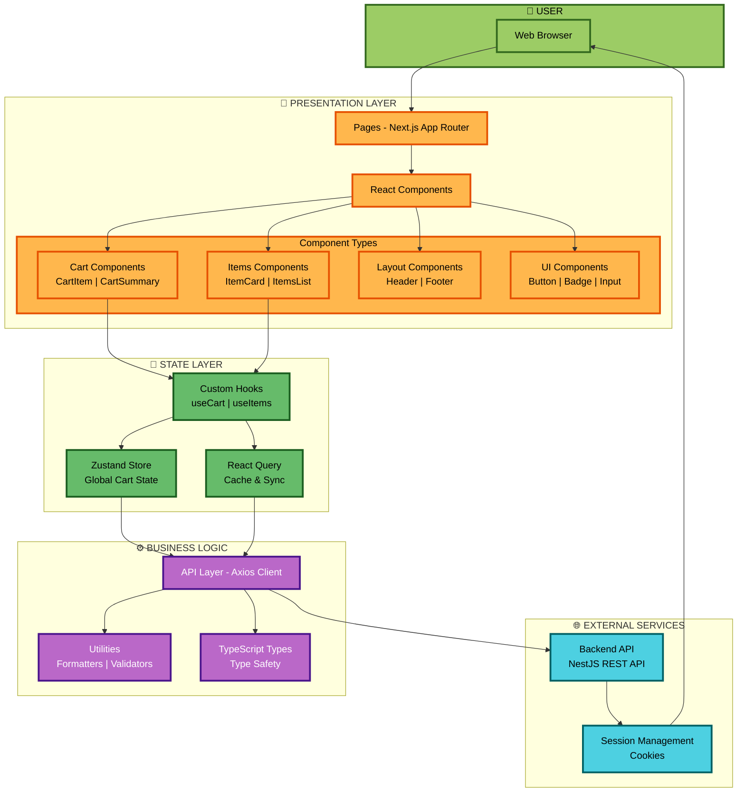
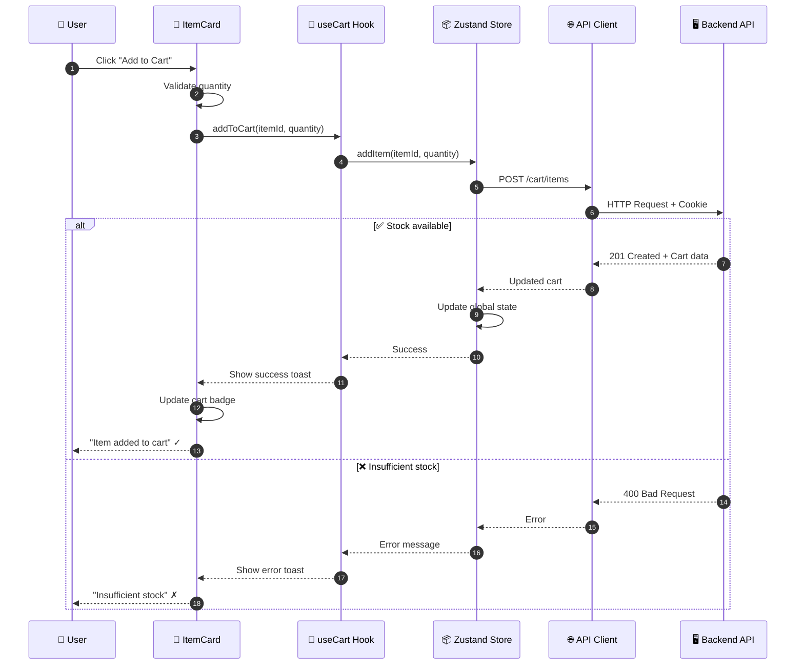
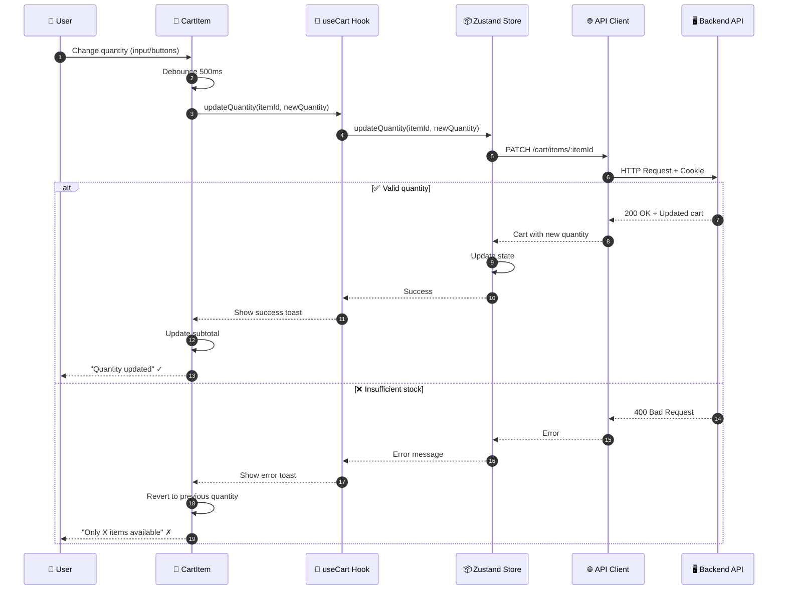
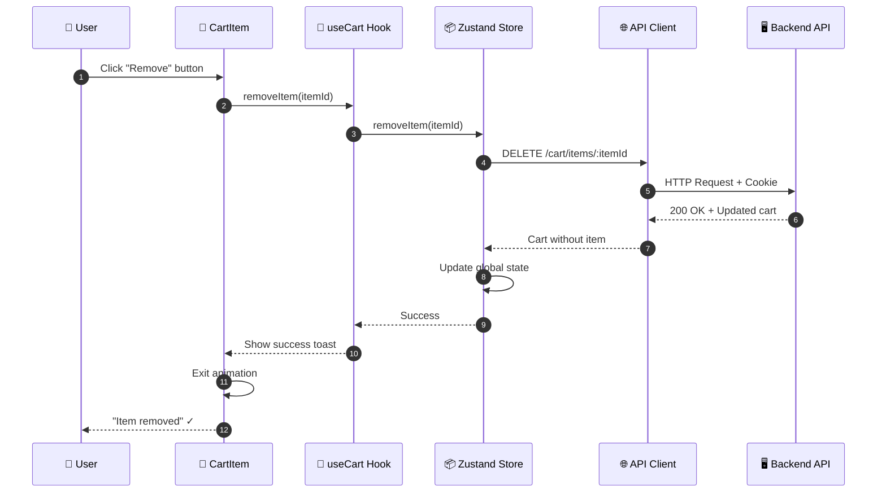
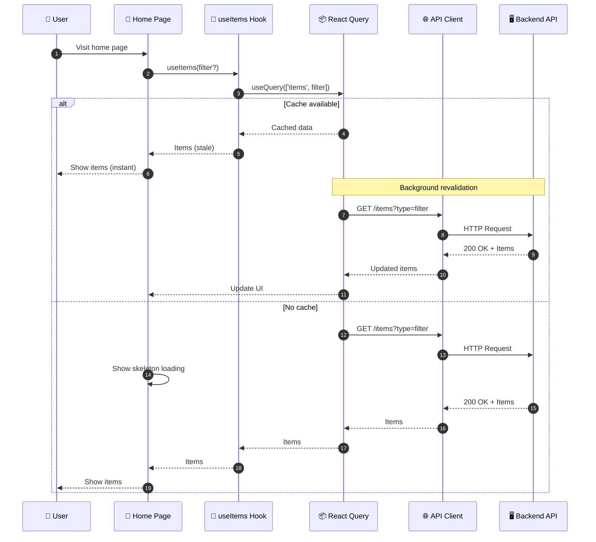

# 🛍️ Shopping Cart Frontend

A modern shopping cart web application built with **Next.js 16**, **React 19**, **TypeScript**, and **Tailwind CSS 4**, following frontend development best practices.

---

## 📑 Table of Contents

- [✨ Description](#-description)
- [🏗️ Architecture](#️-architecture)
  - [Project Structure](#project-structure)
  - [High-Level Architecture Diagram](#high-level-architecture-diagram)
  - [Flow Diagrams](#flow-diagrams)
- [🧰 Tech Stack](#-tech-stack)
- [⚙️ Prerequisites](#️-prerequisites)
- [🚀 Installation & Setup](#-installation--setup)
  - [🐳 Docker](#-docker)
  - [💻 Local Development](#-local-development)
- [📱 Features](#-features)
- [🎨 UI Components](#-ui-components)
- [🔧 Environment Variables](#-environment-variables)
- [🛠️ Technical Decisions](#️-technical-decisions)
- [🎯 Frontend Best Practices](#-frontend-best-practices)
- [👨‍💻 Author](#-author)
- [📄 License](#-license)

---

## ✨ Description

This frontend application implements a complete shopping experience with the following features:

**Product Management:**

- List of available products and events
- Filter by item type (Products/Events)
- Detailed view of each item
- Real-time stock indicators
- Responsive and modern design

**Shopping Cart:**

- Add items to cart with stock validation
- Update quantities interactively
- Remove individual items
- Clear entire cart with confirmation
- Purchase summary with calculated totals
- Session persistence via cookies

The system implements **optimized state management** with Zustand and React Query, providing a smooth and reactive user experience.

---

## 🏗️ Architecture

### Project Structure

```
src/
├── app/                        # Next.js App Router
│   ├── layout.tsx             # Main layout
│   ├── page.tsx               # Home page (items list)
│   ├── cart/                  # Cart page
│   │   └── page.tsx
│   ├── globals.css            # Global styles
│   └── favicon.ico
│
├── components/                 # React Components
│   ├── cart/                  # Cart components
│   │   ├── CartItem.tsx       # Individual cart item
│   │   ├── CartSummary.tsx    # Summary and totals
│   │   └── EmptyCart.tsx      # Empty state
│   │
│   ├── items/                 # Product components
│   │   ├── ItemCard.tsx       # Product card
│   │   ├── ItemsList.tsx      # Products list
│   │   ├── ItemsFilter.tsx    # Search filters
│   │   └── ItemSkeleton.tsx   # Loading skeleton
│   │
│   ├── layout/                # Layout components
│   │   ├── Header.tsx         # Navigation bar
│   │   └── Footer.tsx         # Footer
│   │
│   └── ui/                    # Reusable UI components
│       ├── Button.tsx         # Custom button
│       ├── Badge.tsx          # Badges
│       ├── Card.tsx           # Cards
│       ├── Input.tsx          # Inputs
│       └── ConfirmDialog.tsx  # Confirmation dialogs
│
├── lib/                       # Business logic
│   ├── api/                   # API layer
│   │   ├── client.ts          # Configured Axios client
│   │   ├── cart.ts            # Cart endpoints
│   │   └── items.ts           # Items endpoints
│   │
│   ├── hooks/                 # Custom Hooks
│   │   ├── useCart.ts         # Cart hook
│   │   └── useItems.ts        # Items hook
│   │
│   ├── store/                 # Global state
│   │   └── useCartStore.ts    # Zustand store
│   │
│   ├── types/                 # TypeScript definitions
│   │   ├── cart.ts            # Cart types
│   │   └── item.ts            # Item types
│   │
│   ├── utils/                 # Utilities
│   │   ├── cn.ts              # CSS class merge
│   │   └── formatters.ts      # Data formatting
│   │
│   └── provider/              # Context providers
│       └── QueryProvider.tsx  # React Query Provider
│
└── public/                    # Static files
    ├── next.svg
    ├── vercel.svg
    └── ...
```

### High-Level Architecture Diagram

#### Frontend Layered Architecture



---

### Flow Diagrams

#### 🛒 Add Item to Cart



---

#### 🔄 Update Cart Quantity



---

#### 🗑️ Remove Item from Cart



---

#### 📊 Load Available Items



---

## 🧰 Tech Stack

| Category             | Technology                   | Version |
| -------------------- | ---------------------------- | ------- |
| Framework            | Next.js                      | 16.0.1  |
| UI Library           | React                        | 19.2.0  |
| Language             | TypeScript                   | Latest  |
| Styling              | Tailwind CSS                 | v4      |
| Global State         | Zustand                      | ^5.0.8  |
| Server State         | TanStack React Query         | ^5.90.5 |
| HTTP Client          | Axios                        | ^1.13.1 |
| Notifications        | React Hot Toast              | ^2.6.0  |
| Icons                | Lucide React                 | ^0.552  |
| CSS Utilities        | clsx + tailwind-merge        | Latest  |
| Runtime              | Node.js                      | v20     |

---

## ⚙️ Prerequisites

- Node.js v20+
- npm or yarn
- Backend API running (see [backend README](../backend/README.md))
- Docker & Docker Compose (optional)

---

## 🚀 Installation & Setup

### 💻 Local Development

1. **Clone the repository:**

```bash
git clone https://github.com/SebastianBC09/shopping-cart/tree/main/frontend
cd frontend
```

2. **Install dependencies:**

```bash
npm install
```

3. **Create `.env.local` file:**

```bash
cp .env.example .env.local
```

4. **Configure environment variables in `.env.local`:**

```env
NEXT_PUBLIC_API_URL=http://localhost:3001/api/v1
```

5. **Make sure the backend is running:**

```bash
# In the backend directory
npm run start:dev
```

6. **Start the development server:**

```bash
npm run dev
```

7. **Access the application:**
   - Application: `http://localhost:3000`
   - Backend API: `http://localhost:3001/api/v1`
   - API Docs: `http://localhost:3001/api/docs`

---

### 🐳 Docker

**Recommended for full-stack deployment**

1. **Make sure you have the complete monorepo structure:**

```
shopping-cart-fullstack/
├── backend/
├── frontend/
└── docker-compose.yml
```

2. **Start all services:**

```bash
# From the root directory
docker-compose up --build
```

This will start:

- MongoDB on port `27017`
- Backend API on port `3001`
- Frontend on port `3000`

3. **Access the services:**
   - Frontend: `http://localhost:3000`
   - Backend API: `http://localhost:3001/api/v1`
   - API Docs: `http://localhost:3001/api/docs`

---

## 📱 Features

### 🏠 Home Page

- **Attractive Hero Section**: Modern design with gradients and animations
- **Items Listing**: Responsive grid with product cards
- **Dynamic Filters**: Filter by type (All/Products/Events)
- **Loading States**: Animated skeletons during loading
- **Error Handling**: Clear messages with retry option
- **Empty State**: Friendly message when no results

### 🛒 Shopping Cart

- **Item Management**: Add, update quantity, remove
- **Stock Validation**: Real-time overselling prevention
- **Purchase Summary**: Automatically calculated totals
- **Persistence**: Cart saved in server session
- **Confirmations**: Confirmation dialogs for critical actions
- **Visual Feedback**: Toasts for all actions

### 🎨 User Experience

- **Responsive Design**: Optimized for mobile, tablet, and desktop
- **Smooth Animations**: Fluid transitions in all interactions
- **Loading States**: Loading indicators in all operations
- **Error Handling**: Clear and actionable error messages
- **Optimistic Updates**: Instant UI updates
- **Accessibility**: Accessible components with ARIA labels

---

## 🎨 UI Components

### Cart Components

- **`CartItem`**: Displays individual item with quantity controls
- **`CartSummary`**: Summary with subtotal, taxes, and total
- **`EmptyCart`**: Empty state with call-to-action

### Items Components

- **`ItemCard`**: Product card with image, price, and button
- **`ItemsList`**: Responsive items grid
- **`ItemsFilter`**: Filter buttons by type
- **`ItemSkeleton`**: Loading skeleton for items

### Layout Components

- **`Header`**: Navigation bar with logo and cart
- **`Footer`**: Footer with information

### Reusable UI Components

- **`Button`**: Button with variants (primary, secondary, outline, ghost)
- **`Badge`**: Badges for indicators
- **`Card`**: Reusable card container
- **`Input`**: Input with validation and states
- **`ConfirmDialog`**: Customizable confirmation modal

---

## 🔧 Environment Variables

| Variable                | Required | Default                             | Description                    |
| ----------------------- | -------- | ----------------------------------- | ------------------------------ |
| `NEXT_PUBLIC_API_URL`   | **Yes**  | `http://localhost:3001/api/v1`      | Backend API base URL           |

**Note:** Variables with `NEXT_PUBLIC_` prefix are exposed to the browser.

---

## 🛠️ Technical Decisions

### 🏛️ Architecture Patterns

- **Component-Based Architecture**: Reusable and modular components
- **Custom Hooks Pattern**: Business logic encapsulated in hooks
- **Atomic Design**: Component organization by complexity level
- **Server-Side Rendering**: Next.js App Router for SEO and performance
- **Client-Side State**: Zustand for global state, React Query for server

### 🔗 Key Design Decisions

#### 1. **Next.js 16 App Router**

- File system-based routing
- Server Components by default for better performance
- Client Components only when necessary
- Streaming and Suspense for better UX
- Automatic image and font optimization

#### 2. **Hybrid State Management**

- **Zustand**: Global cart state (simple and performant)
- **React Query**: Cache and server synchronization
- **Local State**: Component state with useState
- Clear separation of responsibilities

#### 3. **React Query for Server Data**

- Automatic data caching
- Background revalidation
- Optimistic updates
- Automatic retry on errors
- Cross-tab synchronization

#### 4. **Tailwind CSS 4**

- Utility-first CSS for rapid development
- Mobile-first responsive design
- Consistent design system
- Automatic purging of unused CSS
- Customization through configuration

#### 5. **Strict TypeScript**

- Type safety throughout the code
- Interfaces for data contracts
- Enhanced IDE autocomplete
- Early error detection
- Better code documentation

#### 6. **Error Handling**

- Error boundaries for React errors
- Toast notifications for immediate feedback
- Clear and actionable error messages
- Console error logging
- Error states in UI

#### 7. **Performance Optimization**

- Automatic code splitting per route
- Lazy loading of heavy components
- Image optimization with Next/Image
- Memoization of expensive components
- Debouncing in search inputs

---

## 🎯 Frontend Best Practices

- ✅ **Component Composition**: Small and reusable components
- ✅ **Type Safety**: TypeScript throughout the code
- ✅ **Responsive Design**: Mobile-first approach
- ✅ **Accessibility**: ARIA labels and keyboard navigation
- ✅ **Performance**: Code splitting and lazy loading
- ✅ **Error Handling**: Robust error handling
- ✅ **User Feedback**: Loading states and notifications
- ✅ **Clean Code**: Readable and well-documented code
- ✅ **Git Workflow**: Semantic commits and organized branches

---

## 📦 Project Scripts

```bash
# Development
npm run dev              # Start development server
npm run build            # Build for production
npm run start            # Start production server

# Code Quality
npm run lint             # Run ESLint
npm run type-check       # Check TypeScript types
```

---

## 🚀 Deployment

### Vercel (Recommended)

1. Connect repository to Vercel
2. Configure `NEXT_PUBLIC_API_URL` environment variable
3. Automatic deployment on each push

### Docker

```bash
# Production build
docker build -t shopping-cart-frontend .

# Run container
docker run -p 3000:3000 shopping-cart-frontend
```

---

## 🎨 Design System

### Color Palette

- **Primary**: Blue (#3B82F6)
- **Accent**: Purple (#8B5CF6)
- **Success**: Green (#10B981)
- **Warning**: Yellow (#F59E0B)
- **Error**: Red (#EF4444)

### Typography

- **Font Family**: System fonts (optimized)
- **Headings**: Bold, 2xl-7xl
- **Body**: Regular, base-lg

### Spacing

- Consistent spacing system (4px base)
- Responsive grid with standard breakpoints

---

## 🔗 Backend Integration

This frontend application connects to the [Backend API](../backend/README.md) to:

- Get list of available items
- Manage shopping cart
- Validate stock in real-time
- Maintain user session

**Endpoints used:**

- `GET /api/v1/items` - List items
- `GET /api/v1/items/:id` - Get item by ID
- `GET /api/v1/cart` - Get current cart
- `POST /api/v1/cart/items` - Add item to cart
- `PATCH /api/v1/cart/items/:id` - Update quantity
- `DELETE /api/v1/cart/items/:id` - Remove item
- `DELETE /api/v1/cart` - Clear cart

---

## 👨‍💻 Autor

**Sebastian Ballen C** - _FullStack Developer_

- LinkedIn: [Sebastian B.](https://www.linkedin.com/in/sebastianballencastaneda-softwaredeveloper)
- Email: sebastian.ballenc@gmail.com

---

## 📄 License

This project is licensed under the MIT License - see the [LICENSE](LICENSE) file for details.

---

## 🔗 Related Links

- [Backend API Documentation](../backend/README.md)
- [Next.js Documentation](https://nextjs.org/docs)
- [React Documentation](https://react.dev)
- [Tailwind CSS Documentation](https://tailwindcss.com/docs)
- [TanStack Query Documentation](https://tanstack.com/query/latest)

---

⭐️ **If you find this project useful, don't forget to give it a star on GitHub!** ⭐️
